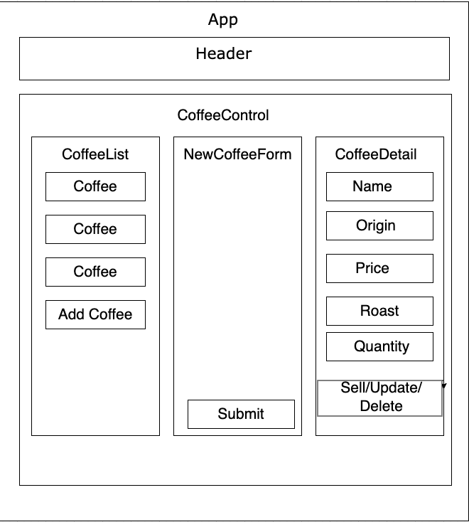

# Inventory Tracker

### Epicodus Independent Code Review - React Fundamentals

### By Peter Vang

## Technologies Used
* Git
* JavaScript
* React
* JSX
* CSS
* HTML

## Description
This is a build application in React that tracks inventory for local business. You would be able to add, see details, and be able to sell coffee bean as the quantity subtract as you sell in pounds.

## Setup/Installation Requirements
* _Requires Visual Studio Code Installation_
* _Requires Terminal Installation_
* _Open the terminal on your local machine_
* _Navigate to the directory inside of which you wish to house this project_
* _Clone this project with the following command  `$ git clone https://github.com/vangpeter06/Inventory-Tracker
* _Navigate to the root directory by entering `$ cd inventory-tracker`_
* _Open this project in Visual Studio Code with the command `$ code .`_
* _Retrieve and install packages needed to run this application with `$ npm install`_
* _Run the application in development mode with `$ npm run start`_
* _Open [http://localhost:3000](http://localhost:3000) to view it in the browser_

## Component Diagram

## Known Bugs
No known bugs at this time

## Improvement Opportunities
* Add Edit and Delete functionality
* Additional Styling

## License

Copyright (c) 2021 Peter Vang
This software is licensed under the MIT license

